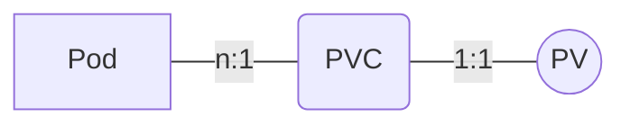

## Pod挂载 PVC / PV （Ceph rbd）

### Pod / PVC / PV 关系图




### 创建PVC / PV

```yaml
kind: PersistentVolume
apiVersion: v1
metadata:
  name: ceph-rbd-pv
spec:
  capacity:
    storage: 1Gi
  accessModes:
    - ReadWriteOnce
  claimRef:
    name: ceph-rbd-claim   # ** 绑定PVC ** 
  rbd:					   # ** 定义RBD参数 **
    monitors:
      - 10.100.224.26:6789
    pool: k8s
    image: ceph-image
    user: admin
    secretRef:
      name: ceph-luminous-admin
    fsType: ext4
---
kind: PersistentVolumeClaim
apiVersion: v1
metadata:
  name: ceph-rbd-claim
spec:
  accessModes:
    - ReadWriteOnce
  resources:
    requests:
      storage: 1Gi
```

### 结论

StatefulSet 多个 Pod 副本，每个 Pod 单独挂载对应 Pod 的 PVC / PV；StatefulSet 或 Pod 删除后，PVC / PV **<u>不会</u>**随之一同删除